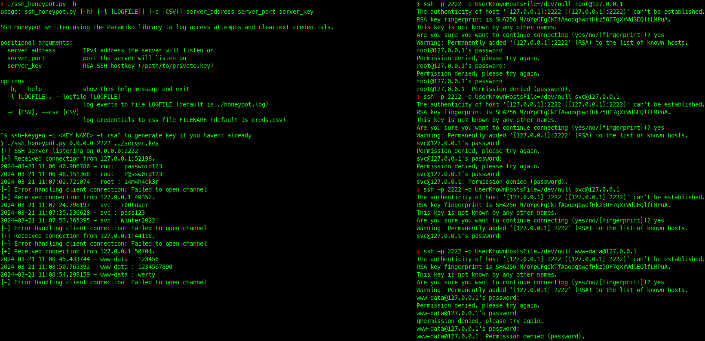

# Secure Shell Honeypot

Simple script that stands up a dummy SSH server that logs access attempts and the credentials used into the console or into an event log and/or a CSV file.

* `pip install paramiko` to install the only required nonstandard library.

* At the moment, it produces some pretty noisy errors when scanned with `nmap` or banner-grabbed with a TCP tool like `nc`, so you may consider redirecting STDERR to dev null (i.e., `2>/dev/null`) until the kinks get worked out. Regardless, if you simply need to log access attempts and grab creds it gets the job done.
